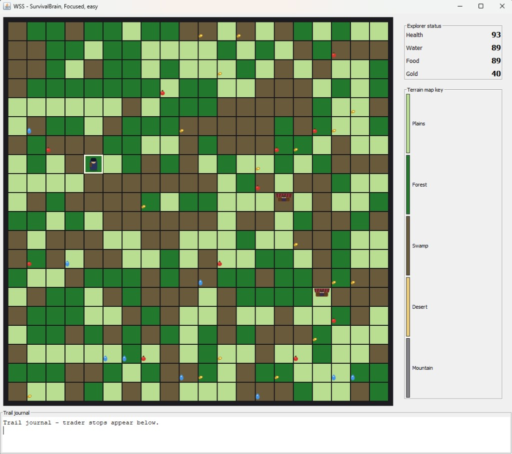
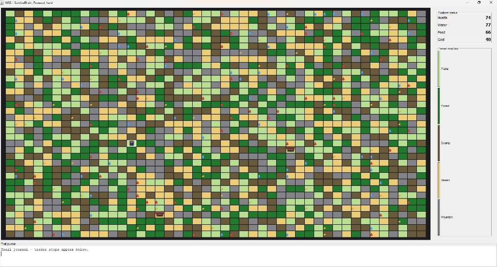

# Wilderness Survival Simulator (WSS)

> A Java desktop expedition sim where an autonomous explorer crosses procedurally generated terrain, manages survival stats, and negotiates with merchants — all driven by swappable **brain** and **vision** strategies.

[](https://openjdk.org/)
[](https://docs.oracle.com/javase/tutorial/uiswing/)
[](#)

**[View on GitHub](https://github.com/cristiangramada/WSS_Project)** · University group project (Object-Oriented Design)

---

## Overview

WSS is a turn-based wilderness expedition game with a **Java Swing** front end. You configure map size, difficulty, AI brain, and vision type at startup; the explorer then runs on autopilot, step by step, until it reaches the eastern edge of the map or runs out of food and water.

The project emphasizes **object-oriented design**: terrain types, movement, vision, trading, and decision-making are modeled as separate, composable classes rather than a single monolithic game loop.

### Highlights

- **Configurable expeditions** — map dimensions (5×5 up to 45×35), three difficulty levels, adjustable step speed
- **Five terrain biomes** — Plains, Forest, Desert, Swamp, and Mountain (hard mode), each with distinct movement, food, and water costs
- **Survival economy** — health, food, water, and gold; loot scattered across the map; starvation ends the run
- **Trader negotiation** — two merchant personalities with hidden behavior; counter-offers until a deal is struck or talks break down
- **Pluggable AI** — swap **brains** (movement strategy) and **vision** (what the explorer can perceive) independently

---

## Screenshots

**Easy difficulty** — SurvivalBrain with Focused vision on a smaller map:



**Hard difficulty** — full biome set including mountains on a larger map:



---

## How it works

1. **Start** on the **west edge** of the map at a random row.
2. **Goal** — reach the **east edge** before food or water hits zero.
3. Each **step**, the explorer’s **vision** surveys nearby tiles and its **brain** picks a move (orthogonal or diagonal).
4. **Terrain** drains food and water; stepping on tiles with loot picks up food, water skins, or gold.
5. **Traders** on the map offer trades; the brain’s negotiation logic decides whether to accept, counter, or walk away.
6. The **trail journal** logs trader interactions; the **stats panel** tracks health, food, water, and gold in real time.

### Brains

| Brain | Behavior |
|-------|----------|
| **SurvivalBrain** | Prioritizes food and water when supplies run low, then pushes east |
| **GreedyEastBrain** | Favors the shortest path toward the eastern goal |

### Vision types

| Vision | Role |
|--------|------|
| **Focused** | Narrow, immediate awareness |
| **Cautious** | Conservative surveying before committing |
| **Keen-Eyed** | Better at spotting resources |
| **Far-Sight** | Wider lookahead across the map |

### Difficulty

| Level | Effect |
|-------|--------|
| **Easy** | Fewer biome types — gentler resource drain |
| **Medium** | More terrain variety |
| **Hard** | Full biome set, including mountains |

---

## Getting started

### Prerequisites

- **JDK 17+** (any modern Java distribution with `javac` and `java` on your PATH)

### Build and run

From the repository root:

```bash
javac -encoding UTF-8 Main.java wss/*.java wss/gui/*.java
java Main
```

On **Windows (PowerShell)**:

```powershell
javac -encoding UTF-8 Main.java wss/*.java wss/gui/*.java
java Main
```

A **Configure expedition** dialog opens first. Choose your settings and click OK to start the simulation.

---

## Architecture

The codebase is organized around small, focused types that collaborate through composition:

```
Main
 └── gui/          Swing UI (window, map grid, stats, new-game dialog)
 └── Map, Square   Procedural world generation and tile state
 └── Terrain/*     Biome subclasses (Plains, Forest, Desert, Swamp, Mountain)
 └── Move/*        Directional step validation (8 directions)
 └── Brain/*       Movement and trade decision strategies
 └── Vision/*      Perception and pathfinding helpers
 └── Trader/*      Merchant personalities and negotiation
 └── Item          Loot (food, water, gold)
```

**Design patterns in practice**

- **Strategy** — `Brain` and `Vision` are interchangeable policies attached to `Player`
- **Polymorphism** — terrain and trader subtypes share behavior through base classes
- **Separation of concerns** — `GameController` handles game logic; `GameWindow` / `MapPanel` handle rendering

---

## Project structure

```
WSS_Project/
├── Main.java              Entry point — launches config dialog and game window
├── wss/
│   ├── Map.java           Map generation, loot placement, trader stalls
│   ├── Player.java        Stats, position, brain, and vision
│   ├── Brain*.java        AI movement strategies
│   ├── Vision*.java       Perception implementations
│   ├── *Trader.java       Merchant negotiation logic
│   ├── Move*.java         Step validation per direction
│   └── *Terrain.java      Biome cost definitions
└── wss/gui/
    ├── GameWindow.java    Main frame and autoplay timer
    ├── GameController.java Game loop: move, loot, trade, win/lose
    ├── MapPanel.java      Colored terrain grid
    └── NewGameDialog.java Startup configuration
```

---

## Team

Group project — **Object-Oriented Design**:

| Contributor | GitHub |
|-------------|--------|
| Cristian Gramada | [@cristiangramada](https://github.com/cristiangramada) |
| Julianna | [@juliarias20](https://github.com/juliarias20) |
| Natalie Tran | — |

---

## Portfolio blurb

Short copy you can reuse on [cristiangramada.com](https://cristiangramada.com):

> **Wilderness Survival Simulator** — Java/Swing desktop game exploring OOP design through composable AI strategies, procedural terrain, and trader negotiation. Configure brain and vision modules, then watch an autonomous explorer cross a survival map toward the eastern goal.

---

## License

Academic coursework project. All rights reserved by the authors unless otherwise noted.
